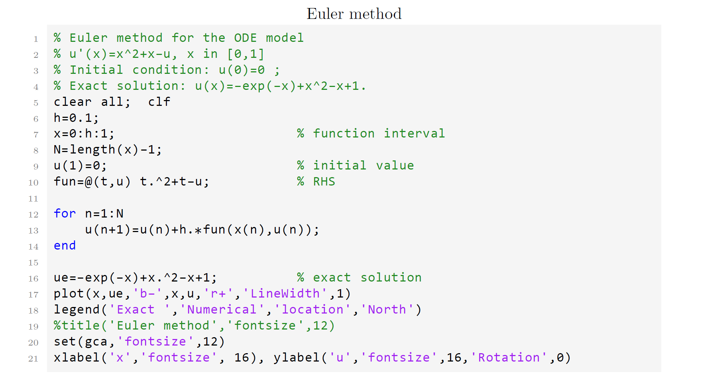
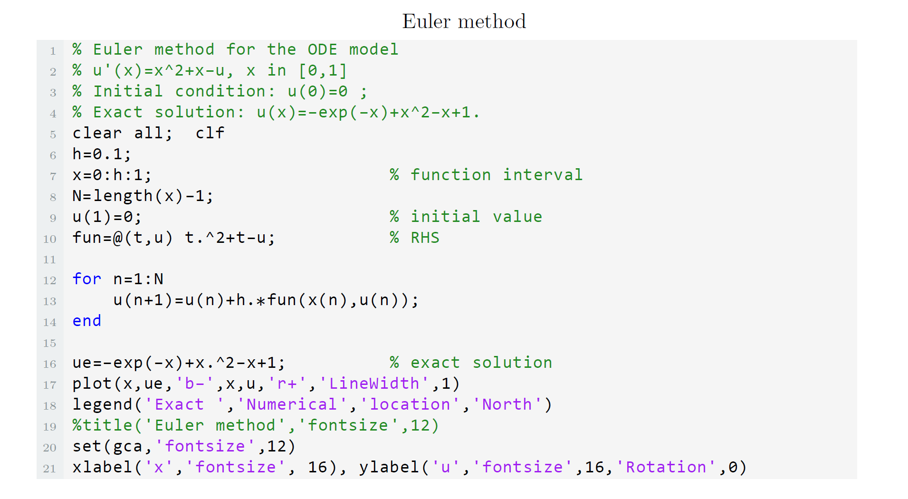
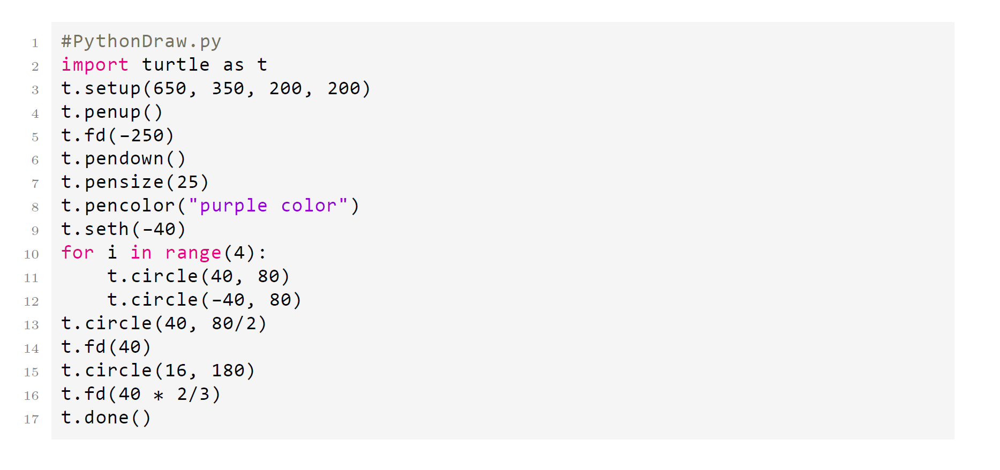

# Code LaTeX Style

**listings** package to design code style, mainly including MATLAB LaTeX highlighting style and Python LaTeX highlighting style.

## MATLAB LaTeX highlighting style

### Source

``` latex
\documentclass{article}

\input{matlab-style.tex}   % code style file

\begin{lstlisting}[title={Code Name}]
% Matlab Code
······
\end{lstlisting}
```
### Result



## MATLAB LaTeX highlighting style 2

### Source

``` latex
\documentclass{article}

\input{matlab-style2.tex}   % code style file

\begin{lstlisting}[title={Code Name}]
% Matlab Code
······
\end{lstlisting}
```

### Result



## MATLAB and Python LaTeX highlighting style

### Source

``` latex
\documentclass{article}

\input{matlab-style2.tex}   % code style file

\begin{Matlab}
% Matlab Code
······
\end{Matlab}

\begin{Python}
% Matlab Code
······
\end{Python}
```

### Result

MATLAB highlighting style is the same as the first MATLAB style.

Python highlighting style



## Code Style

**code-style.tex**  is a general setting for code, using the **listings** package definition of programming language.

