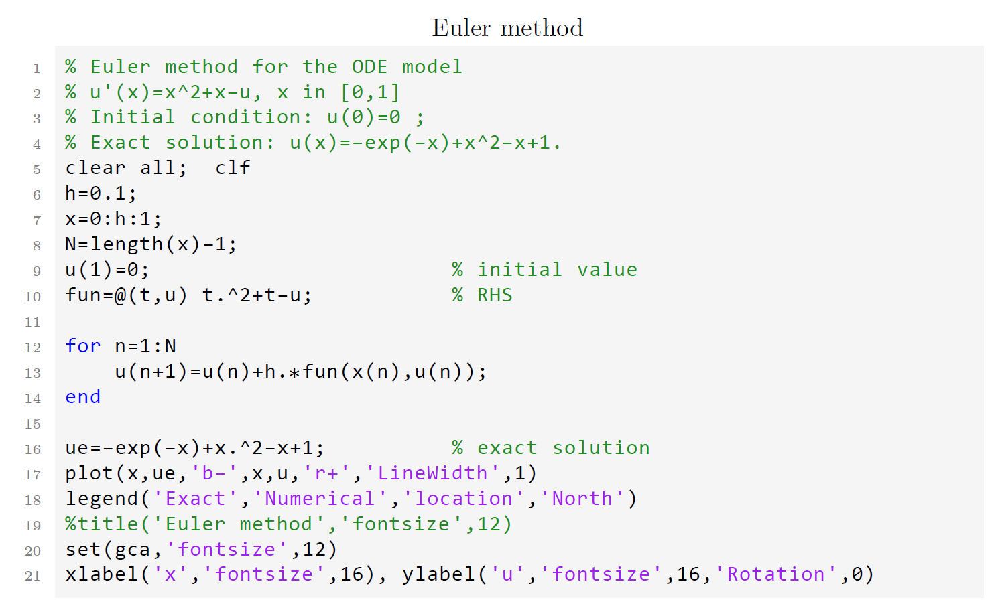

# Code LaTeX Style

Use **listings** package to design code highlighting style, mainly including MATLAB LaTeX highlighting style and Python LaTeX highlighting style.

### MATLAB LaTeX highlighting style

Source file: `mcode-style1.tex`

### MATLAB LaTeX highlighting style 2

Source file: `mcode-style2.tex`

### MATLAB and Python LaTeX highlighting style 1

Source file: `mpcode-style1.tex`

MATLAB highlighting style is the same as the first one.

Python highlighting style

### MATLAB and Python LaTeX highlighting style 2

Source file: `mpcode-style2.tex`

MATLAB highlighting style is the same as the second one.

Python highlighting style

